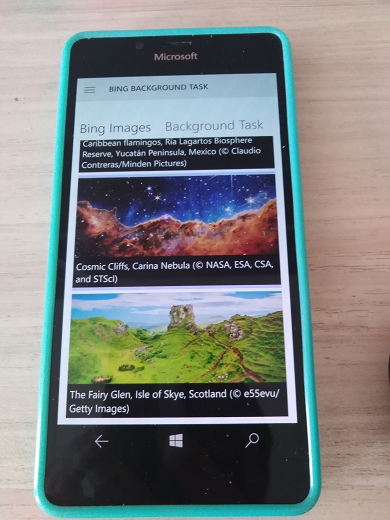

# AwesomeBandBackgrounds ('BandCentral' codename)
Echo / fork of 10-years [AwesomeBandBackgrounds](https://github.com/LanceMcCarthy/Lancelot.AwesomeBandBackgrounds) app / hit by [Lance McCarthy](https://github.com/LanceMcCarthy)

## About
The ultimate Microsoft Band companion app. Access millions of amazing, high definition wallpaper photos and dozens of professional palette-based themes.

## Screenshots

## Status
- Reverse Engeneering completed. Dll Flickr dll lib analogs found.
- The code refactored a little to support the real "UWP multi-platform" (W10 / W10M; PC / Mobile). 
- The funcionality reduction ("app simplify") started to plan.  
- Min. Win. os. build 15063 at now; background tasks disabled (re-dev not ready yet)

## Installation Options
- [Microsoft Store](https://www.microsoft.com/en-us/p/awesome-band-backgrounds/9nblggh3g0sn)
- Source Code: See the [Developer Note](https://github.com/LanceMcCarthy/Lancelot.AwesomeBandBackgrounds#developer-note) section for important information.

## Features
- Multi-device support: Automatic detection for Microsoft Band 1 or Microsoft Band 2
- Stylish Themes:
- Pick your theme colors from professional palettes
- Theme History to quickly set any past themes you want to use again
- Image sources: Millions of photos at your fingertips in an infinite scrolling list from a variety of available sources: Flicker, 500px, Bing, OneDrive
- Local files on your phone
- Preview: Get an instant preview of how image looks on your band before you apply it
- Effects: Crop and apply dozens of amazing effects to photos
- Speed: search, pick and set your background in seconds.
- Favorites: Full Favorites list experience, with the ability to set background even faster
- Background Updates: The background task can update the image automatically for you
- Backups: Cloud backup and restore favorites from cloud

## Developer (Lance McCarthy) Note
"Lance McCarthy have open sourced this to give back to the community the hundreds and hundreds of hours of work over the years. From custom controls, to UI features, these are available in the source in the src/ subfolder. You can compile the projects locally and interact with everything in the VS 2022 designer. While preparing this for open source, I have put a lot of recent work into compatibility with modern tools.

However, if you want to actually run and use this app from code (instead of installing from the Store), you will need to get your own API keys with the various services. These values are set in the various constants files in the src/BandCentral.Models/Secrets folder."

## References
- https://github.com/LanceMcCarthy GitHub Page of Lance McCarthy, great developer 
- https://github.com/LanceMcCarthy/Lancelot.AwesomeBandBackgrounds Original AwesomeBandBackgrounds
- https://www.youtube.com/watch?v=1Qu8rB8z3lA Awesome Band Backgrounds * You-tube video (Mark Guim, WindowsCentral)
- https://www.windowscentral.com/awesome-band-backgrounds Awesome Band Backgrounds * article; May 13, 2015 (Mark Guim)
- https://gadgetshelp.com/windows/awesome-band-backgrounds-obnovleny-s-podderzhkoi-band-2-do-sikh-por-predlagaet-mnozhestvo-oboev-band/ * article (in Russian)

## .. 
AS IS. No support. RnD only.

## .
[m][e] 2022